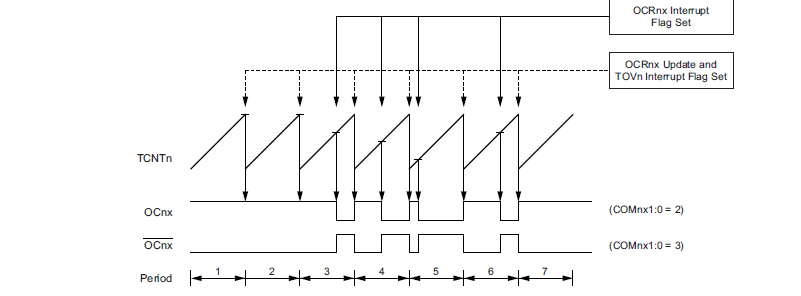

# code_Bluegriot

Ce code a été réalisé dans le cadre d'un projet visant à déterminer l'impédance interne d'un super condensateur de manière embarquée. La figure ci-dessous illustre la méthode utilisée. Un transistor est piloté par un signal sinusoïdal pour permettre une ondulation de la tension et du courant passant dans le super condensateur. Le signal sinusoïdal est généré en filtrant un signal PWM à valeur moyenne sinusoïdale provenant d'une Arduino UNO. Suite à cela, les deux ondulations, ainsi que le signal PWM filtré, sont récupérés et permettent, en isolant la partie réelle et imaginaire de la tension et du courant, de remonter à l'impédance interne.

Le code dans ce git s'intéresse à la création d'un signal PWM à valeur sinusoïdale et à l'acquisition de l'ondulation en tension, en courant, et du signal PWM filtré. Ces données sont transmises à un ordinateur grâce à une liaison série et sont ensuite traitées en utilisant Python.

Afin d'obtenir un signal sinusoïdal à 1kHz, la fréquence de la PWM sera de 20kHz. Pour ce faire, on règle le timer 2 en mode fast PWM. Le diagramme temporel du mode fast PWM est disponible ci-dessous.

Le réglage du mode Fast PWM se fait en mettant les bits `WGM2[0:2]` des registres `TCCR2A`, `TCCR2B` à la valeur 7. Le bit `COM2B1` du registre `TCCR2A` est lui mis à 1, ce qui permet de configurer le pin 3 de l'Arduino en sortie. Ce mode permet la génération d'une PWM à la fréquence suivante f_PWM = f_clk / (N × (OCR2A + 1)) avec f_clk la fréquence de l'horloge (16 MHz), N le prescaler, et `OCR2A` un registre. Pour obtenir une fréquence de 20 kHz, on règle le prescaler sur 8 en mettant à 1 le bit `CS21` du prescaler `TCCR2B`. Il reste ensuite à charger la valeur 99 dans le registre `OCR2A`.

Il est aussi important de savoir que lorsque le timer 2 atteint la valeur de `OCR2A`, un flag est mis à 1. En mettant à 1 le bit `OCIE2A` du registre `TIMSK2`, on active les interruptions lors du débordement du Timer 2. On modifie alors, dans un processus d'interruption, la valeur du registre `OCR2B`, responsable de la largeur d'impulsion (entre 0 et `OCR2A`), par la valeur suivante du tableau de valeurs images de la sinusoïde.

