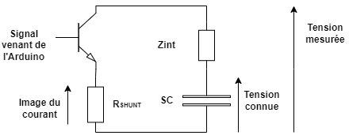

# code_Bluegriot

Ce code a été réalisé dans le cadre d'un projet visant à déterminer l'impédance interne d'un super condensateur de manière embarquée. La figure ci-dessous illustre la méthode utilisée. Un transistor piloté par un signal sinusoïdal, généré en filtrant un signal PWM à valeur moyenne sinusoïdale provenant d'une Arduino UNO, est utilisé pour permettre une ondulation de la tension et du courant passant dans le super condensateur. Ces deux ondulations, ainsi que le signal PWM filtré, sont ensuite récupérés et permettent, en isolant la partie réelle et imaginaire de la tension et du courant, de remonter à l'impédance interne.

Le code dans ce git s'intéresse à la création d'un signal PWM à valeur sinusoïdale et à l'acquisition de l'ondulation en tension, courant et du signal PWM filtré. Ces données sont transmises à un ordinateur grâce à une liaison série et sont ensuite traitées en utilisant Python. 

